# Ebola Crisis Hub Architecture

> **Audience:** engineers, technical program staff, and maintainers who need to understand how the app collects, classifies, displays, and deploys Ebola virus disease (EVD) public-information data.

Ebola Crisis Hub is a full-stack situational awareness application for monitoring public information related to Ebola virus disease, with emphasis on the DRC/Uganda outbreak corridor and related regional signals.

The central design choice is that the app keeps **official epidemiological counts** separate from **public news/RSS signals**:

- **Official situation counts** are parsed from selected authority pages such as Uganda Ministry of Health, WHO Disease Outbreak News, and ECDC.
- **Public information signals** are ingested from RSS/news feeds, filtered for EVD relevance, classified, mapped, and presented as triage information.

The app is **not** an epidemiological surveillance system. It does not create confirmed case counts from media headlines. Confirmed figures should be checked against the linked official source pages.

---

## 1. Product Boundary

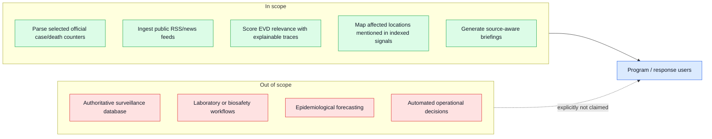

### User-Facing Interpretation

| App surface | What it means | What it does **not** mean |
| --- | --- | --- |
| Official situation cards | Parsed counters from selected official pages | Complete national line-list surveillance |
| Map points | Locations mentioned in indexed public signals | Confirmed geographic incidence |
| Severity chips | Automated triage score, capped by source trust | Official risk classification |
| Source tiers | Heuristic label for configured source feed/domain | Full publisher verification for every article |
| Briefings | Synthesis over indexed article set | Official situation report |

---

## 2. System Context

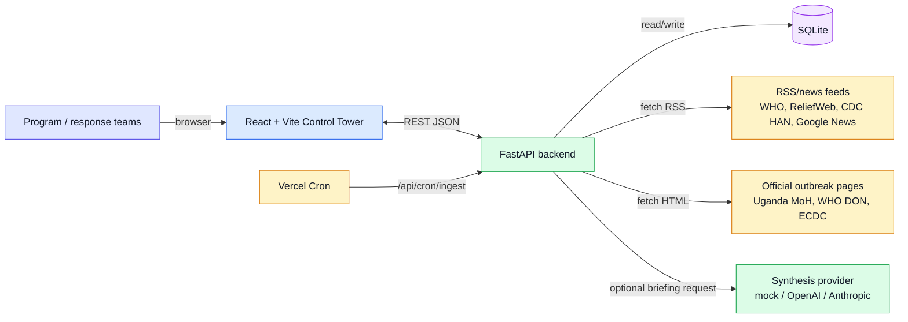

### Main Runtime Components

| Layer | Code location | Responsibility |
| --- | --- | --- |
| React app shell | `frontend/src/App.tsx`, `frontend/src/components/layout/AppShell.tsx` | Tabs, refresh/ingest/search actions, date filters, data loading |
| Control tower view | `frontend/src/components/ControlTowerView.tsx` | Map, official situation panel, trust/severity panels, timeline, alerts |
| API router | `backend/app/api/router.py` | Mounts dashboard, tower, feed, search, sources, official, briefings, cron routers |
| RSS ingestion | `backend/app/services/ingestion.py` | Source seeding, RSS fetch, duplicate checks, article enrichment |
| Relevance tracing | `backend/app/services/relevance_trace.py` | Multi-pillar EVD scoring and explainable trace JSON |
| Domain rules | `backend/app/services/ebola_domain.py` | Location catalog, EVD regexes, categories, severity rules |
| Official stats parsing | `backend/app/services/official_stats.py` | Fetches selected official pages and parses case/death counters |
| Source trust | `backend/app/services/source_trust.py` | Classifies source tiers and caps aggregator severity |
| Persistence | `backend/app/models/*.py`, `backend/app/db/database.py` | SQLAlchemy models, SQLite engine, lightweight schema migrations |
| Briefing synthesis | `backend/app/services/synthesizer.py` | Mock/OpenAI/Anthropic briefing generation over selected articles |

---

## 3. Data Lanes

The app has two lanes that meet in the UI but do not share the same semantics.

```mermaid
flowchart TB
  subgraph OfficialLane["Official counts lane"]
    officialPages["Selected official HTML pages"]
    parseOfficial["Parse counters by regex/HTML text"]
    officialApi["GET /api/official/situation"]
    officialUi["Official situation panel"]
  end

  subgraph SignalLane["Public signal lane"]
    feeds["RSS/news feed entries"]
    normalize["Clean HTML, normalize URL/date/title"]
    relevance["Assess relevance and verdict"]
    classify["Category, severity, locations, trust tier"]
    store[("SQLite articles")]
    towerApi["GET /api/tower, /api/feed, /api/search"]
    towerUi["Map, timeline, live feed, alerts"]
  end

  officialPages --> parseOfficial --> officialApi --> officialUi
  feeds --> normalize --> relevance --> classify --> store --> towerApi --> towerUi

  classDef official fill:#fee2e2,stroke:#dc2626,color:#111827
  classDef signal fill:#ecfeff,stroke:#0891b2,color:#111827
  classDef data fill:#f3e8ff,stroke:#9333ea,color:#111827

  class officialPages,parseOfficial,officialApi,officialUi official
  class feeds,normalize,relevance,classify,towerApi,towerUi signal
  class store data
```

### Why This Separation Matters

Official counts have a higher evidentiary bar than public news signals. The app can display both in the same dashboard, but it should not blur them:

- Official cards say “confirmed cases” and “deaths” only because they come from official pages.
- RSS/news articles say “signals,” “alerts,” or “mentions,” because they are public-information artifacts.
- Briefings synthesize articles; they are not official case-count products.

---

## 4. Official Situation Counts

Implemented in `backend/app/services/official_stats.py`.

### Configured Official Sources

| Source | URL | Parsed fields currently implemented |
| --- | --- | --- |
| Uganda Ministry of Health — EVD Daily | `https://evd-daily.health.go.ug/` | Uganda confirmed cases, deaths, recoveries, admissions, imported cases, local cases, active contacts |
| WHO Disease Outbreak News — DON608 | `https://www.who.int/emergencies/disease-outbreak-news/item/2026-DON608` | DRC confirmed cases/deaths; Uganda confirmed cases/deaths, probable deaths, imported cases, recoveries |
| ECDC Communicable Disease Threats — DRC/Uganda EVD | `https://www.ecdc.europa.eu/en/ebola-outbreak-democratic-republic-congo-and-uganda` | DRC confirmed cases/deaths; Uganda confirmed cases/deaths and some import/local transmission details when present |

### Official Counts Sequence

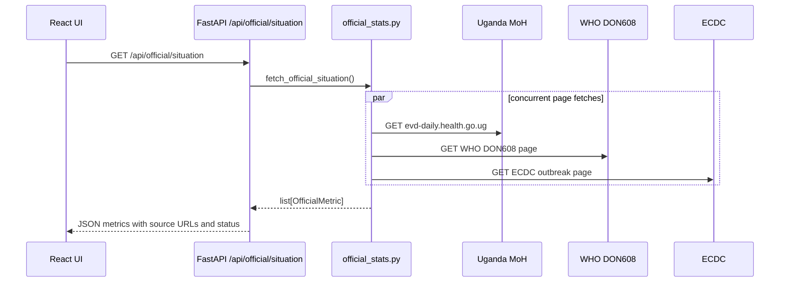

### Official Metric Shape

The API returns rows shaped like:

```json
{
  "country": "Uganda",
  "confirmed_cases": 20,
  "deaths": 2,
  "recoveries": 14,
  "admissions": 4,
  "imported_cases": 15,
  "local_cases": 5,
  "contacts_active": 9,
  "source_name": "Uganda Ministry of Health — EVD Daily",
  "source_url": "https://evd-daily.health.go.ug/",
  "source_type": "national_ministry",
  "as_of": "Monday, 22 June 2026",
  "status": "ok"
}
```

### Accuracy Notes

- The parser is based on visible page text and regular expressions.
- If a source changes wording or layout, the row may fail or return partial metrics.
- Rows preserve source differences instead of forcing a single truth. The UI cumulative display chooses one strongest row per country before summing.
- The app currently fetches official pages on demand from the API route; it does not persist official metric snapshots.

---

## 5. Public Signal Ingestion

Implemented in `backend/app/services/ingestion.py`.

### Default RSS/News Sources

| Source group | Examples | Notes |
| --- | --- | --- |
| Primary public health / humanitarian feeds | WHO News, CDC HAN, ReliefWeb DRC/Ebola | Relevance-filtered at ingest; not every item becomes an article |
| Google News EVD queries | DRC/Uganda outbreak, vaccine, contact tracing, broad Ebola, Sudan ebolavirus | Treated as aggregator/unverified source tier |
| Broad Ebola queries | `ebola`, `ebola Africa outbreak`, Sudan ebolavirus terms | Added to catch wider signals beyond initial corridor queries |

### Ingestion Sequence

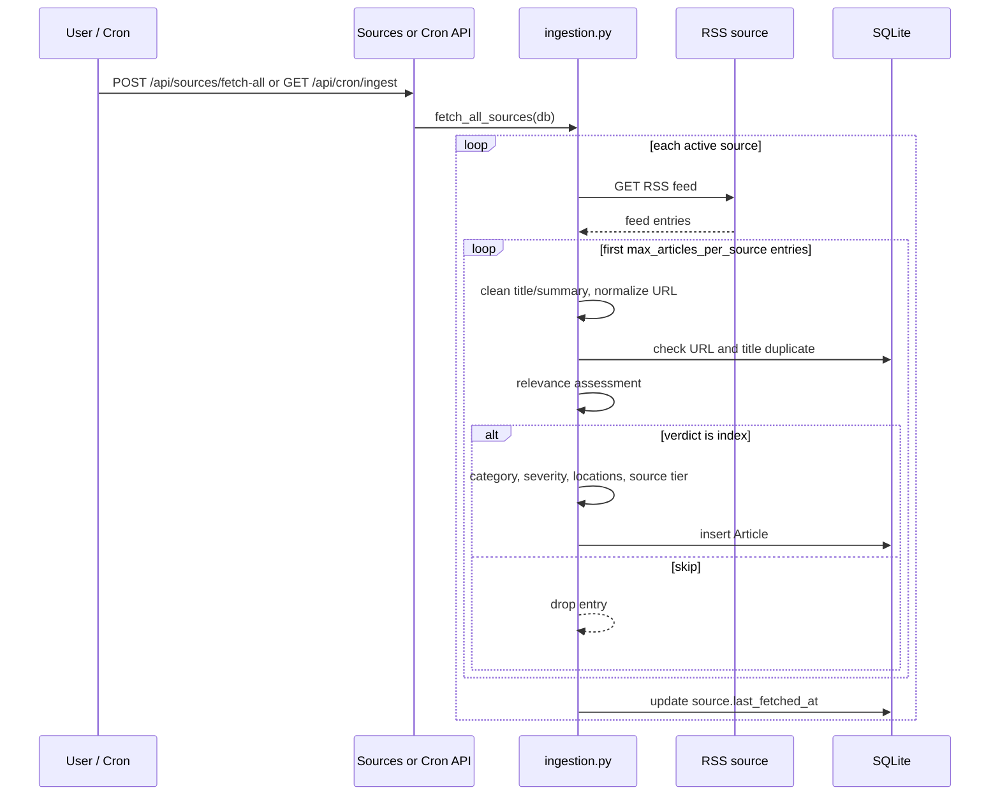

### Duplicate Protection

The article table has a unique URL constraint. Ingestion also checks:

- raw URL and normalized URL
- title fingerprint against recent article titles
- title similarity for near-duplicate headlines

This is especially important for Google News feeds, where many outlets may syndicate or repeat similar headlines.

---

## 6. Relevance Tracing

Implemented in `backend/app/services/relevance_trace.py` and called from `ingestion.py` via `assess_article_relevance()`.

Every indexed article stores a JSON `relevance_trace` on the `articles` table. The trace includes:

- `goal`: currently `drc_uganda_evd_corridor`
- `score`: normalized score from 0 to 1
- `verdict`: `index`, `watch`, or `skip`
- `source_context`: `dedicated_feed`, `agency_feed`, `aggregator`, `regional_feed`, or `general`
- `signals`: weighted positive signals
- `negatives`: penalties such as off-topic disease noise

### Scoring Pillars

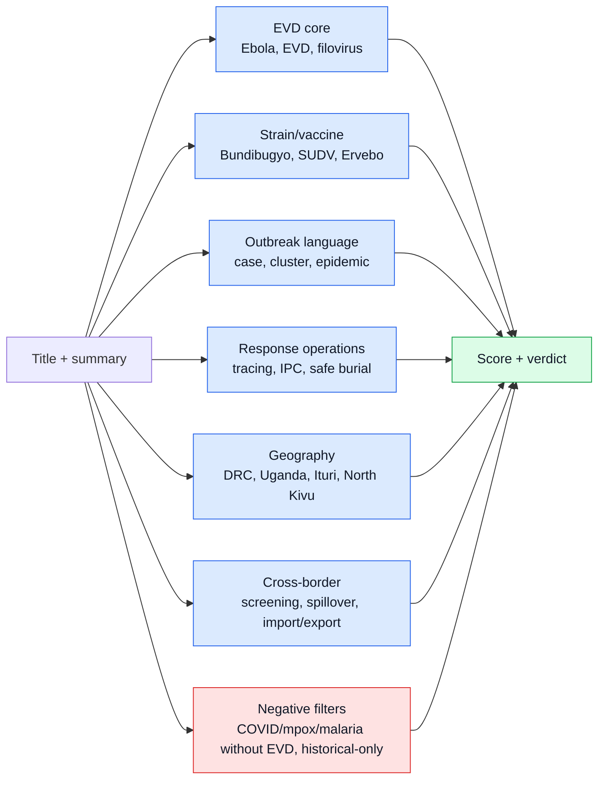

### Verdict Thresholds

| Source context | Indexing rule |
| --- | --- |
| Dedicated EVD/DRC feed | Lower threshold (`MIN_DEDICATED_SCORE`) if EVD, corridor, outbreak, or response context exists |
| General / agency / aggregator feeds | Index when score reaches `MIN_INDEX_SCORE` |
| Borderline EVD items | Can receive `watch`, but current article insertion only stores indexed items |
| Clear noise | `skip` |

### Stored Trace Example

```json
{
  "goal": "drc_uganda_evd_corridor",
  "score": 0.7,
  "verdict": "index",
  "source_context": "aggregator",
  "signals": [
    {"pillar": "evd_core", "label": "Ebola / filovirus topic", "weight": 0.38},
    {"pillar": "cross_border", "label": "Cross-border / screening / corridor signal", "weight": 0.1}
  ],
  "negatives": []
}
```

---

## 7. Source Trust and Severity

Implemented in `backend/app/services/source_trust.py` and `backend/app/services/ebola_domain.py`.

### Trust Tier Rules

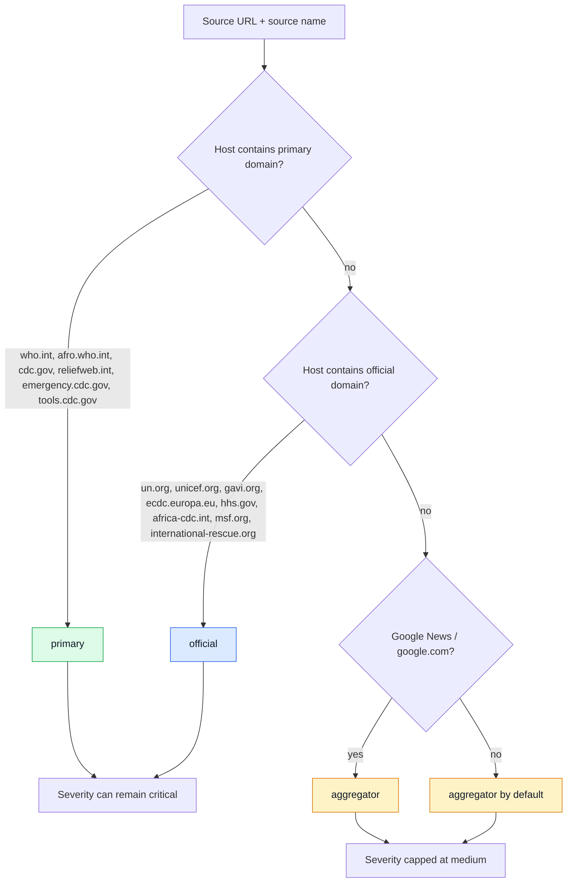

### Important Nuance

For Google News feeds, the source tier is attached to the configured feed (`news.google.com`), not necessarily the original publisher linked inside the Google News item. The UI therefore labels these as media/aggregator signals and caps severity conservatively.

---

## 8. Data Model

Implemented in `backend/app/models/*.py`.

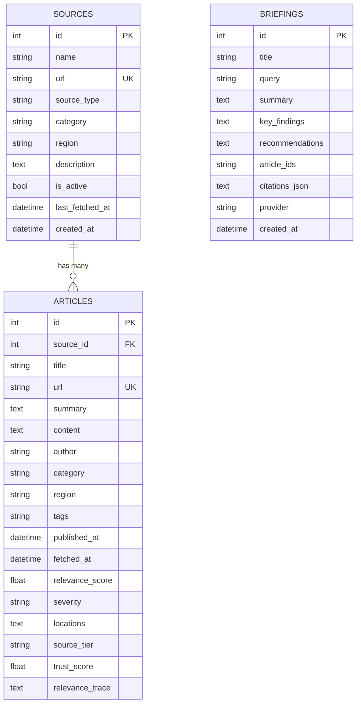

### Storage Notes

- `articles.url` is unique.
- `sources.url` is unique.
- `locations` is stored as JSON text, then converted to arrays for API responses.
- `relevance_trace` is stored as JSON text.
- `article_ids` on `briefings` is a comma-separated string, not a join table.
- There is lightweight SQLite migration logic in `backend/app/db/database.py`, not Alembic migrations.

---

## 9. API Surface

Mounted under `/api` in `backend/app/api/router.py`.

| Method | Path | Router | Role |
| --- | --- | --- | --- |
| `GET` | `/api/dashboard` | `dashboard.py` | Summary counts, source tiers, categories, latest briefing |
| `GET` | `/api/tower` | `tower.py` | Control tower aggregate: stats, headline, alerts, timeline, map points |
| `GET` | `/api/tower/region` | `tower.py` | Detail view for selected map location |
| `GET` | `/api/feed` | `feed.py` | Recent ranked articles, optionally category/severity/date filtered |
| `POST` | `/api/search` | `search.py` | Full-text search over indexed EVD signals |
| `GET` | `/api/sources` | `sources.py` | Source inventory with article counts |
| `POST` | `/api/sources` | `sources.py` | Create a source |
| `POST` | `/api/sources/seed` | `sources.py` | Seed default sources |
| `POST` | `/api/sources/reprocess` | `sources.py` | Recompute article metadata/traces |
| `POST` | `/api/sources/fetch-all` | `sources.py` | Fetch all active sources |
| `POST` | `/api/sources/{source_id}/fetch` | `sources.py` | Fetch one source |
| `GET` | `/api/official/situation` | `official.py` | Fetch and parse official situation counts |
| `GET` | `/api/briefings` | `briefings.py` | List stored briefings |
| `POST` | `/api/briefings/generate` | `briefings.py` | Generate a briefing for search/default context |
| `GET` | `/api/cron/ingest` | `cron.py` | Vercel Cron ingestion route |

---

## 10. Frontend Architecture

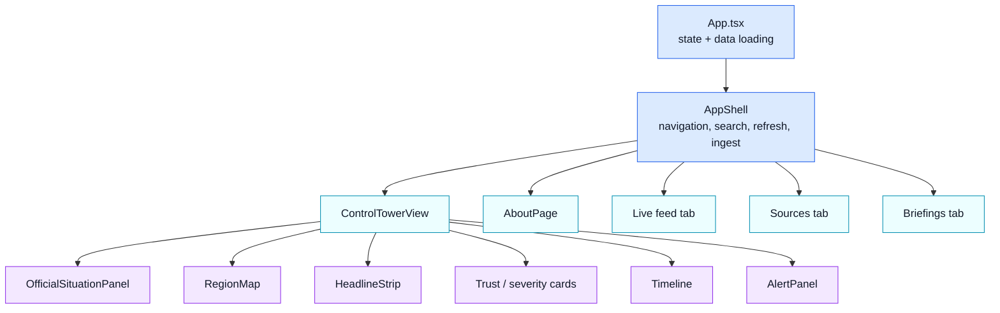

### Client Data Loading

`App.tsx` loads these resources in parallel on refresh:

- `api.tower(dateParams)`
- `api.feed(50, ..., dateParams)`
- `api.sources()`
- `api.briefings()`
- `api.officialSituation()`

The UI auto-refreshes every five minutes in the browser. The sidebar copy says “Auto-refresh every 30 min,” which is currently inaccurate relative to `App.tsx`; update that copy if it matters for production messaging.

---

## 11. Briefing Synthesis

Implemented in `backend/app/services/synthesizer.py`.

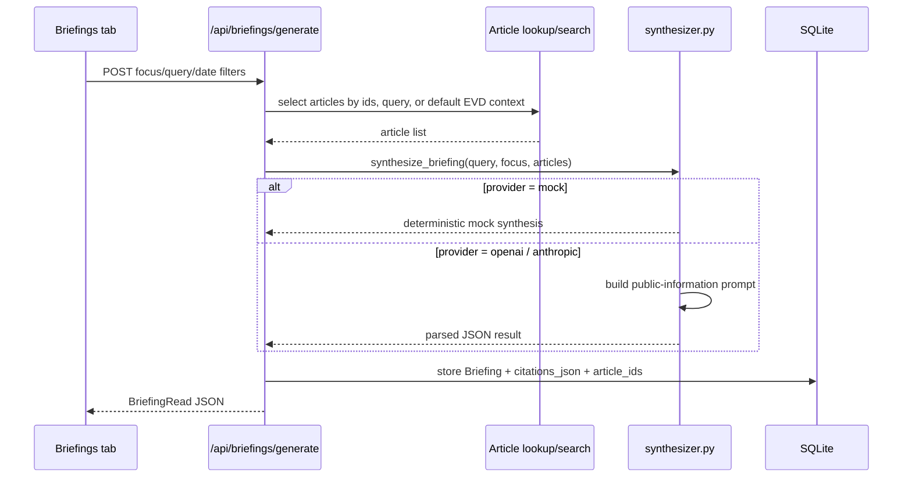

### Safety and Scope

The prompt frames the task as public-information situational awareness, not laboratory or biosafety guidance. It instructs the model to separate confirmed facts from speculation and to use confirmed confidence only for primary/official sources.

### Current Limitations

- The default provider is `mock`.
- The briefing is only as good as the selected article set.
- Briefing citations refer to article IDs, not official count rows.

---

## 12. Deployment Architecture

The repo is configured for full-stack Vercel deployment.

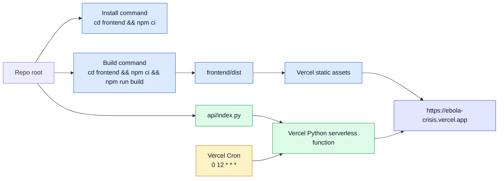

`vercel.json` defines:

- Build command: `cd frontend && npm ci && npm run build`
- Install command: `cd frontend && npm ci`
- Output directory: `frontend/dist`
- API rewrite: `/api/:path*` to `/api/index.py`
- Python function max duration: 60 seconds
- Cron route: `/api/cron/ingest` at 12:00 UTC daily

### Local Development

| Service | Command | URL |
| --- | --- | --- |
| Backend | `cd backend && source .venv/bin/activate && uvicorn app.main:app --reload --port 8000` | `http://localhost:8000` |
| Frontend | `cd frontend && npm run dev` | `http://localhost:5173` |
| API docs | backend running | `http://localhost:8000/docs` |

### Persistence Caveat

SQLite works locally and for demos. On Vercel, serverless files are ephemeral. The README already warns that data in `/tmp` can reset on cold starts. For production persistence, move to Turso, Neon, Postgres, Railway/Render with volume storage, or another durable database.

---

## 13. Operational Playbook

### Fetch New Public Signals

Use one of:

- UI: **Ingest**
- API: `POST /api/sources/fetch-all`
- Vercel Cron: `/api/cron/ingest`

Expected result: source rows return `new_articles`, `total_fetched`, `status`, and optional error message.

### Recompute Relevance and Metadata

Use:

```bash
curl -X POST http://localhost:8000/api/sources/reprocess
```

This re-cleans summaries and recomputes category, relevance score, severity, locations, source tier, trust score, and relevance trace for existing articles.

### Check Official Counts

Use:

```bash
curl http://localhost:8000/api/official/situation
```

If a row returns `status: "error"`, inspect the `notes` field. Most failures are likely page fetch issues or source page wording/layout changes.

### Validate Before Deploy

Recommended checks:

```bash
cd frontend && npm run build
cd backend && source .venv/bin/activate && python -m compileall -q app
curl http://localhost:8000/api/dashboard
curl http://localhost:8000/api/official/situation
```

Deploy:

```bash
npx vercel --prod --yes
```

---

## 14. Known Gaps and Risks

| Area | Current state | Risk | Recommended improvement |
| --- | --- | --- | --- |
| Official stats persistence | Fetched on demand, not stored | No history of official counts inside app | Cache rows with fetched timestamp and source version |
| Official parsers | Regex over page text | Source wording changes can break extraction | Add parser tests using saved HTML fixtures |
| Database | SQLite | Vercel storage can reset | Move to durable DB |
| Briefing citations | Article IDs only | Official counts not cited in briefing findings | Add official metric citations to briefing context |
| Google News source tier | Feed-level aggregator label | Original publisher may be official, but hidden behind Google URL | Resolve final publisher URL if needed |
| Date handling | Date filters support published/fetched | Source time zones and missing dates vary | Add explicit date normalization tests |
| Security/auth | No user auth in current app | Public URL can trigger ingest/search if exposed | Add auth/rate limiting for non-demo use |
| Monitoring | No app-level telemetry | Parser or ingest failures may be noticed late | Add source health dashboard and alerts |

---

## 15. Extension Roadmap

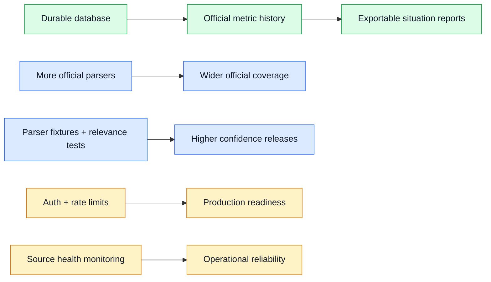

Priority order for a more production-grade system:

1. Move article/source/briefing storage to a durable database.
2. Store official metric snapshots with source URL, fetched timestamp, and parser status.
3. Add parser fixture tests for Uganda MoH, WHO DON, and ECDC pages.
4. Add relevance scoring tests for known positive/negative examples.
5. Add authentication or at least restrict ingest and briefing generation.
6. Add source health monitoring and visible parser failure states.

---

## 16. File Map

| Path | Purpose |
| --- | --- |
| `frontend/src/App.tsx` | Top-level client state, refresh, search, fetch, briefing handlers |
| `frontend/src/api.ts` | TypeScript API client and shared response types |
| `frontend/src/components/ControlTowerView.tsx` | Overview/control tower page composition |
| `frontend/src/components/OfficialSituationPanel.tsx` | Official counts cards and cumulative collapsed display |
| `frontend/src/components/RegionMap.tsx` | Leaflet map and location markers |
| `frontend/src/components/AboutPage.tsx` | User-facing about/explanation page |
| `backend/app/main.py` | FastAPI app setup, startup tasks, background fetch loop locally |
| `backend/app/api/router.py` | API route registration |
| `backend/app/services/ingestion.py` | RSS ingestion and article enrichment |
| `backend/app/services/relevance_trace.py` | Goal-oriented relevance scoring |
| `backend/app/services/ebola_domain.py` | Domain regexes, locations, severity/category logic |
| `backend/app/services/source_trust.py` | Source tier and severity cap rules |
| `backend/app/services/official_stats.py` | Official count fetchers/parsers |
| `backend/app/services/tower.py` | Control tower aggregate and region detail logic |
| `backend/app/services/synthesizer.py` | Briefing prompt, mock provider, OpenAI/Anthropic adapters |
| `backend/app/db/database.py` | SQLite engine and lightweight schema migration |
| `vercel.json` | Vercel build, rewrite, function, and cron configuration |

---

## 17. Summary

Ebola Crisis Hub is best understood as a **two-lane situational awareness system**:

1. A small official-statistics lane for selected case/death counters.
2. A broader public-signal lane for news/RSS triage, relevance scoring, mapping, and briefing synthesis.

The architecture is intentionally conservative about claims: official counts are sourced from official pages; media-derived items are signals; automated scoring is triage support; and production use should address persistence, parser tests, auth, and monitoring.
